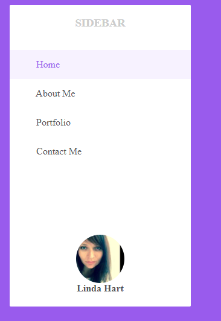
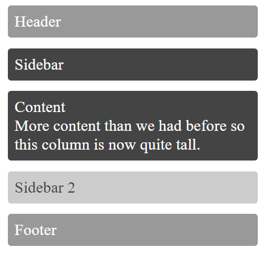
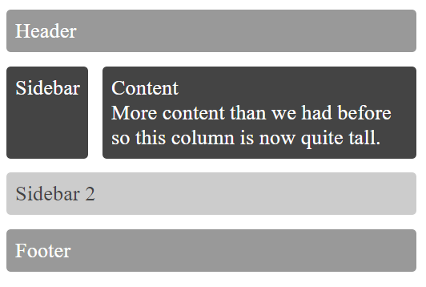
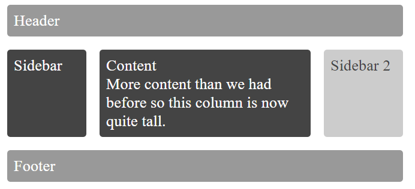
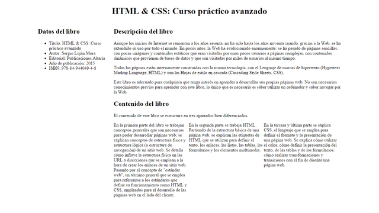


## Ej1. FLEX (**xxx pts**)

Realizar los cambios necesarios en el código fuente en la carpeta [ej01_flex](ej01_flex) para crear un componente de barra lateral reutilizable con un menú de navegación por los datos de un perfil de redes sociales como el siguiente:

Aspectos a tener en cuenta:
  - El maquetado del componente barra lateral contiene 3 elementos principales:
      - marcador de posición para el logo SIDEBAR
      - bloque de navegación (Home, About me…) con iconos de Fontawesome
      - bloque de perfil de usuario, que contiene la imagen del perfil
  - La barra lateral ocupará el 100% de la altura disponible hasta un máximo de 500px.
  - Utilizar flexbox para alinear los 3 elementos de la barra lateral como se ve en la imagen 1
  - El bloque de navegación ocupará todo el espacio disponible de la barra lateral, de manera que la imagen de perfil se ubicará al final de la barra.
  - El logo y el bloque de perfil de usuario estarán centrados.
  - Redondear la imagen de perfil

## Ej2. GRID y MQ (**xxx pts**)

Partiendo del código fuente en la carpeta [ej02_gridMQ](ej02_gridMQ)
Podemos redefinir con grid la posición de los elementos usando también Media Queries. Definir las siguientes áreas de cuadrícula por defecto (aplicando el principio Mobile First) 

A continuación, redefine las áreas de cuadrícula y la posición de los elementos en esa cuadrícula con consultas de medios según las siguientes especificaciones:
Para anchura entre 500 y 600px: (la barra lateral ocupa un 20% anchura disponible)

Para anchura superior a 600px: (anchura de barras laterales 120px cada una, separación entre celdas 20px

## Ej3. DISEÑO LÍQUIDO (**1 pt**)

A partir de la página web que se te proporciona en [ej04_Diseño_liquido](ej04_Diseño_liquido), debes escribir las reglas CSS necesarias para lograr una página web que tenga el mismo aspecto que la siguiente imagen:

Las características del diseño de esta página son:
  - Un diseño centrado con un ancho del 80%.
  - El encabezado de nivel 1 centrado.
  - El contenido principal de la página se organiza en dos columnas, una de 25% de ancho y la otra el espacio restante de 75%.
  - La lista que explica el contenido del libro se muestra como un texto a tres columnas del mismo ancho.
Puedes modificar el código HTML proporcionado para añadir los identificadores y clases que necesites. También puedes añadir etiquetas 
 para definir elementos contenedores en la página.

1) Aspecto de la web a pantalla completa:

## Ej4. DISEÑO ELÁSTICO (**3 pts**)

A partir de la página web que se te proporciona en [ej05_Diseño_elastico](ej05_Diseño_elastico), debes escribir las reglas CSS necesarias para lograr una página web que tenga el mismo aspecto que la siguiente imagen:

Las características del diseño de esta página son:
    • Un diseño elástico centrado con un ancho de 60 em.
    • El encabezado de nivel 1 centrado.
    • El contenido principal de la página se organiza en dos columnas, una de 16 em de ancho y la otra el espacio restante de 44 em.
    • La lista que explica el contenido del libro se muestra como un texto a tres columnas del mismo ancho.

Puedes modificar el código HTML proporcionado para añadir los identificadores y clases que necesites. También puedes añadir etiquetas 
 para definir elementos contenedores en la página.
